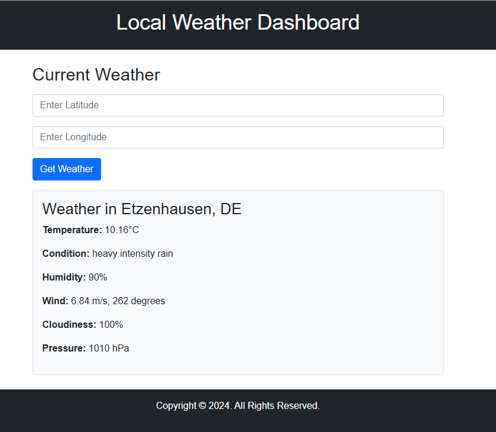

# Local-Weather-Dashboard
Create a web-based dashboard that displays weather information for the user's current location. This dashboard will leverage HTML5, CSS, and JavaScript, including HTML5's Geolocation API.
## Project Overview
The Local Weather Dashboard is a simple web application designed to display current weather conditions based on the user's geographic location. Users can view weather details such as temperature, humidity, wind speed, and more. The project utilizes the OpenWeatherMap API to fetch real-time weather data.

## Features
- **Geolocation Support**: Automatically detects the user's current location to display the local weather.
- **Manual Location Entry**: Users can manually enter latitude and longitude to get weather information for any global location.
- **Responsive Design**: Compatible with various devices and screen sizes.

## Technologies Used
- **HTML5**
- **CSS3**: For styling.
- **Bootstrap 5**: For responsive design.
- **JavaScript**: For dynamic content and API integration.

## How to Set Up and Run the Project
1. **Clone the Repository**:
   ```bash
   git clone https://github.com/Z-Mosayebi/Local-Weather-Dashboard/tree/main
   cd local-weather-dashboard
   ```
2. **Open `index.html` in Your Browser**: 
   - You can run a local server or simply open the file in a browser to see the project in action.

## Configuration
- **API Key**: The project requires an API key from OpenWeatherMap. Follow the steps below to configure it:
  1. Obtain an API key from [OpenWeatherMap](https://openweathermap.org/).
  2. Create a `config.json` file in the root directory and include your API key as follows:
     ```json
     {
       "API_KEY": "your_api_key_here"
     }
     ```
  3. Ensure `config.json` is listed in your `.gitignore` to keep your API key secure.

## Contributing
Contributions are welcome! If you have suggestions or improvements, please fork the repository and submit a pull request.

## License
This project is open-sourced under the MIT License. 

